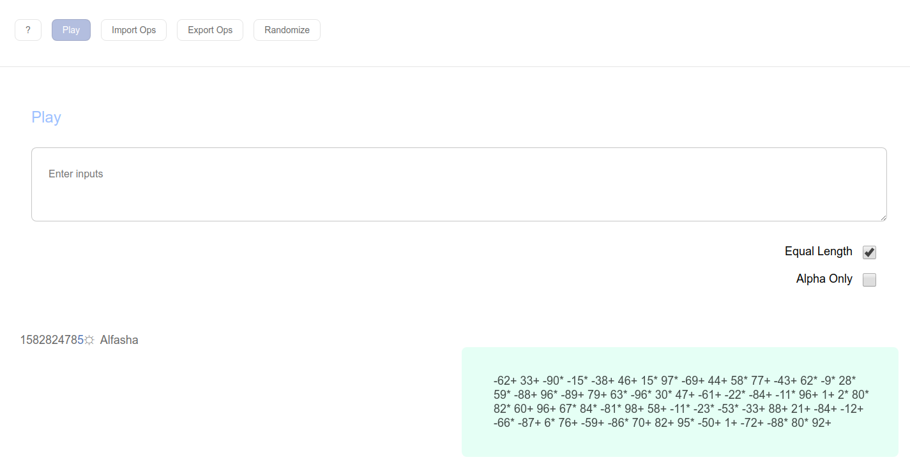

# Alfasha | Alpha Version

Alfasha is a super experimental obfuscation playground tool. It's like a rabbit in a hat. It is purely for experimentation with the concept of obfuscations. Alfasha is named as a play on words.

## Getting Started

Open alfa.html, or visit it live at [alfasha.now.sh/alfa.html](https://alfasha.now.sh/alfa.html) 

### Disclaimer

It's written in Javascript. This software is experimental and probably has bugs. 

## Built With

* Javascript, css, html

## License

This project is licensed under the MIT License - see the [LICENSE.md](LICENSE.md) file for details

## Acknowledgments

* Inspired by [masterpasswordapp](https://masterpassword.app) 

